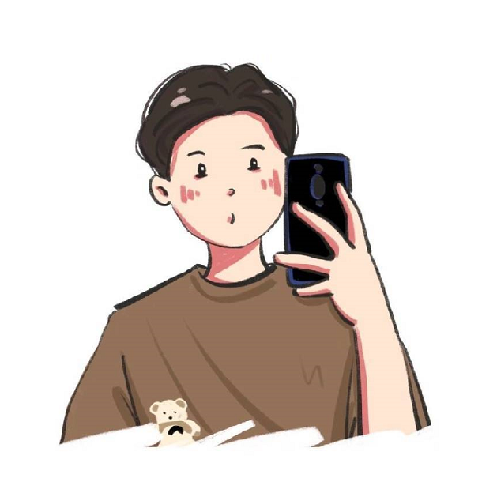
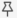
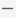

## 访微信页面
> 计算机协会 - 前端技术部练习项目
### 1. 实现目标
实现仿微信通讯录页面


### 1. 总体布局
####  （1）布局分析
实现页面的第一的步骤是分析页面的总体布局，进而写出总体的html骨架，从图片中我们可以看到，微信布局大体上是左右分布，分三块。
左侧：功能导航按钮。
中间：通讯录选择列表
右侧：微信Logo

使用FSCapture的取色器功能，可以拾取各个部分的颜色，此处直接提供颜色，感兴趣的同学可以下载FSCapture进行取色场是。
* 左侧雅黑背景：```#2E2E2E``` <span style="margin-left:10px; display:inline-block;width:10px; height:10px; background:#2E2E2E; border: 1px solid #000;"></span>
* 中间灰色背景：```#EBEAEB```<span style="margin-left:10px; display:inline-block;width:10px; height:10px; background:#EBEAEB; border: 1px solid #000;"></span>
* 右侧浅灰背景：```#F5F5F5```<span style="margin-left:10px; display:inline-block;width:10px; height:10px; background:#F5F5F5; border: 1px solid #000;"></span>

#### （2）布局实现
对于横向排列的布局，可以通过表格、行内块元素、浮动、flex布局（弹性赫子）实现。
* 表格布局方式实现：由于不够灵活，在html早期简单页面应用较多，现已过时
* 通过行内块元素布局：能够实现一行布局多个容器（盒子），但是在实践中很少使用
* 通过浮动实现：常见的布局方式之一，应用十分广泛，由于使用浮动之后，导致```盒子塌陷问题```，需要进行```清除浮动```。
* 通过flex布局实现：是新的布局方式，不管是水平还是垂直排列，都能较好控制，可用flex布局取代浮动。
**这次的练习中我们统一使用 “弹性盒子” flex布局。**
对于总体布局，我们进行总体框架的搭建。
1. 初始化基础样式
```css
 <style>
        /* 去除所有元素的默认样式 */
        
        * {
            margin: 0;
            padding: 0;
        }
        /* 设置根元素样式 */
        
        html,
        body {
            background-color: #8f95b6;
            width: 100%;
            height: 100%;
        }
    </style>
```
2. 编写总体骨架布局
```html
 <!-- 一个大容器内部包裹三个小的容器 -->
    <div class="main-wrap">
        <!-- 左侧导航栏 -->
        <div class="left-nav-wrap"></div>
        <!-- 中间联系人 -->
        <div class="contact-wrap"></div>
        <!-- 右侧logo页面 -->
        <div class="logo-wrap"></div>
    </div>
```
3. 编写总体股价简单css样式
```css
 <style>
         .main-wrap {
            /* 微信窗口大小 */
            width: 888px;
            height: 574px;
            /* 设置布局方式为flex布局 */
            display: flex;
            /* 圆角+阴影效果*/
            border-radius: 3px;
            overflow: hidden;
            box-shadow: 1px 1px 10px #ccc;
        }
        /* 左侧导航栏样式 */
        
        .main-wrap .left-nav-wrap {
            width: 55px;
            height: 100%;
            background-color: #2E2E2E;
        }
        /* 联系人列表样式 */
        
        .main-wrap .contact-wrap {
            width: 250px;
            height: 100%;
            background-color: #EBEAEB;
        }
        /* 右侧logo样式 */
        
        .main-wrap .logo-wrap {
            /* flex: 1 表示填充剩余范围 */
            flex: 1;
            background-color: #F5F5F5;
        }
    </style>
```
4. 结果预览


### 2. 左侧布局
####  （1）布局分析
左侧布局在内容上，分为三块，即```头像、业务功能栏、系统功能栏```。
仔细观察可以发现，这三块其实是有距离区别的，这三部分的内部元素是紧凑的，而三者之间的距离是比较大的，所以我们在布局的时候，也应该分成三块。
比较难处理的是```系统功能栏```因为前两部分元素是靠近顶部的，而默认的元素排列也是靠近顶部的，直接编写html代码，之后通过```margin```或者```padding```即可实现布局，而系统功能栏如果也通过这样的方法，做到“看似”依附于底部，硬编码距离上方的范围是不优雅的，正确的解决方案可以使用浮动或flex布局，我们这里统一使用flex布局。在flex布局中，用一个盒子包裹“头像”和“业务功能栏”，另一个盒子包裹“系统功能栏”，使用```justify-content: space-between;```设置上下的对齐方式为中间留空，元素分布在（上下）两边即可。
####  （2）布局实现
1. html基础样式
```html
  <!-- 左侧导航栏 -->
        <div class="left-nav-wrap">
            <!-- 部分一：上方的头像和业务功能栏 -->
            <div class="top-wrap">
                <!-- 左侧导航栏的头像 -->
                <div class="head-wrap">
                    
                </div>
                <!-- 业务功能栏 -->
                <div class="business-wrap">
                    <div class="business-item">
                        
                    </div>
                    <div class="business-item">
                        
                    </div>
                    <div class="business-item">
                        
                    </div>
                    <div class="business-item">
                        
                    </div>
                    <div class="business-item">
                        
                    </div>
                    <div class="business-item">
                        
                    </div>
                    <div class="business-item">
                        
                    </div>
                    <div class="business-item">
                        
                    </div>
                </div>
            </div>
            <!-- 部分二：下方的系统功能栏 -->
            <div class="bottom-wrap">
                <div class="bottom-item">
                    
                </div>
                <div class="bottom-item">
                    
                </div>
                <div class="bottom-item">
                    
                </div>
            </div>
        </div>
```

2. 左侧大盒子容器样式
```css
/* 左侧导航栏样式 */
        
        .main-wrap .left-nav-wrap {
            width: 55px;
            height: 100%;
            background-color: #2E2E2E;
            /* 设置导航栏为flex布局 */
            display: flex;
            /* 设置导航栏为主轴为垂直排列方式（默认水平） */
            flex-direction: column;
            /* 设置导航栏为侧轴居中对齐（即左右居中） */
            align-items: center;
            /* 设置导航栏主轴对齐方式 */
            justify-content: space-between;
            /* 设置上下内边距 */
            padding: 20px 0;
            /* 设置盒子模式，让内边距占用内部空间 */
            box-sizing: border-box;
        }
```

3. 内部样式
```css
 /* 这部分所有图片样式为填充父布局 */
        
        .left-nav-wrap img {
            width: 100%;
            height: 100%;
            /* 适应方式：自动缩放调整大小填充父布局 */
            object-fit: contain;
        }
        /* 头像样式 */
        
        .head-wrap {
            padding-top: 10px;
            width: 37px;
            height: 37px;
        }
        /* 功能列表 */
        
        .business-wrap .business-item,
        .bottom-wrap .bottom-item {
            width: 22px;
            height: 22px;
            /* 调整边距，找到最适合的位置 */
            margin-top: 20px;
            margin-left: 7px;
            /* 鼠标移动过到此处样式设置为小手 */
            cursor: pointer;
        }
```

4. 结果预览

### 3. 中间布局
####  （1）布局分析

这部分的布局较为复杂，我们仍然从总体进行分析，一步步细化，如上图，我们将这部分总体上分为3部分，```上方搜索栏、下方可滚动部分```。
现在进行细化：
* 上方搜索栏可以细化为：搜索输入框、添加好友按钮，二者为水平排列的布局
* 下方滚动栏可以细化为：顶部“通讯录管理”按钮，下方多个样式相似的“分组”
* 对```样式相似的“分组”```可以细化为：”顶部标题“、”下方内容“，二者垂直排列
* 对”下方内容“可以细化为：”图标或头像（本质是图片）“、”名称“，二者水平排列
至此，我们已经完成了这部分所有内容的分析，我们发现，这样的复杂布局，是我们学过的”水平“和”垂直“的布局方式的组合。
布局可以按照如下框架处理(注意层次结构):
```html
  <!-- 中间联系人 -->
        <div class="contact-wrap">
             <!-- 上方搜索部分 -->
            <div class="top-search">
                <input class="search">
                <div class="add-friends"></div>
            </div>
            <!-- 下方可滚动部分 -->
            <div class="scroll-wrap">
                <!-- 通讯录管理按钮 -->
                <div class="contact-mamange-button">通讯录管理</div>
                <!-- 不同的内容组(可以一个也可以多个) -->
                <div class="management-item-group">
                    <!-- 组标题 -->
                    <div class="title">标题</div>
                    <!-- 组内容(1-n:可以一个也可以多个) -->
                    <div class="management-item">
                        <!-- 图片(头像) -->
                        <div class="management-item-img">
                            
                        </div>
                        <!-- 名字 -->
                        <div class="management-item-name">
                            <span>群聊</span>
                        </div>
                    </div>
                </div>
            </div>
        </div>
```
####  （2）布局实现
1. html基础结构
```html
   <!-- 中间联系人 -->
        <div class="contact-wrap">
            <!-- 上方搜索部分 -->
            <div class="top-search">
                <input class="search" placeholder="搜索">
                <div class="add-friends"></div>
            </div>
            <!-- 下方可滚动部分 -->
            <div class="scroll-wrap">
                <!-- 通讯录管理按钮 -->
                <div class="contact-mamange-button">通讯录管理</div>
                <!-- 不同的内容组(可以一个也可以多个) -->
                <div class="management-item_group">
                    <!-- 组标题 -->
                    <div class="title">新的朋友</div>
                    <!-- 组内容(1-n:可以一个也可以多个) -->
                    <div class="management-item">
                        <!-- 图片(头像) -->
                        <div class="management-item-img">
                            
                        </div>
                        <!-- 名字 -->
                        <div class="management-item-name">
                            <span>新的朋友</span>
                        </div>
                    </div>

                </div>

                <div class="management-item_group">
                    <!-- 组标题 -->
                    <div class="title">公众号</div>
                    <!-- 组内容(1-n:可以一个也可以多个) -->
                    <div class="management-item">
                        <!-- 图片(头像) -->
                        <div class="management-item-img">
                            
                        </div>
                        <!-- 名字 -->
                        <div class="management-item-name">
                            <span>公众号</span>
                        </div>
                    </div>

                </div>

                <div class="management-item_group">
                    <!-- 组标题 -->
                    <div class="title">X</div>
                    <!-- 组内容(1-n:可以一个也可以多个) -->
                    <div class="management-item">
                        <!-- 图片(头像) -->
                        <div class="management-item-img">
                            
                        </div>
                        <!-- 名字 -->
                        <div class="management-item-name">
                            <span>徐海双</span>
                        </div>
                    </div>
                </div>

                <div class="management-item_group">
                    <!-- 组标题 -->
                    <div class="title">Z</div>
                    <!-- 组内容(1-n:可以一个也可以多个) -->
                    <div class="management-item">
                        <!-- 图片(头像) -->
                        <div class="management-item-img">
                            
                        </div>
                        <!-- 名字 -->
                        <div class="management-item-name">
                            <span>张景睿</span>
                        </div>
                    </div>
                    <div class="management-item">
                        <!-- 图片(头像) -->
                        <div class="management-item-img">
                            
                        </div>
                        <!-- 名字 -->
                        <div class="management-item-name">
                            <span>张一然</span>
                        </div>
                    </div>
                </div>

                <div class="management-item_group">
                    <!-- 组标题 -->
                    <div class="title">#</div>
                    <!-- 组内容(1-n:可以一个也可以多个) -->
                    <div class="management-item">
                        <!-- 图片(头像) -->
                        <div class="management-item-img">
                            
                        </div>
                        <!-- 名字 -->
                        <div class="management-item-name">
                            <span>其它内容</span>
                        </div>
                    </div>
                </div>

            </div>
        </div>

```
2. css样式
```css
  <style>
            .contact-wrap {
                /* 设置为flex布局 */
                display: flex;
                /* 设置主轴为垂直排列方式（默认水平） */
                flex-direction: column;
                padding-bottom: 10px;
                box-sizing: border-box;
            }
            /* 顶部搜索容器 */
            
            .top-search {
                box-sizing: border-box;
                width: 100%;
                height: 60px;
                background-color: #F7F7F7;
                /* 设置内边距在计算时,算在内部空间 */
                box-sizing: border-box;
                padding-top: 20px;
                /* 用flex布局,以便搜索框和搜索按钮能够水平排列 */
                display: flex;
            }
            /* 顶部搜索框 */
            
            .top-search .search {
                width: 192px;
                height: 26px;
                margin-left: 12px;
                /* 去除默认样式  */
                outline: 0;
                border: 0;
                background-color: #E2E2E2;
                /* 圆角 */
                border-radius: 4px;
                /* 设置文字相对于输入款内部的间距 */
                padding-left: 10px;
                padding-right: 10px;
                box-sizing: border-box;
                /* 文字大小 */
                font-size: 10sp;
            }
            /* 顶部搜索框右边的加好友 */
            
            .top-search .add-friends {
                width: 26px;
                height: 26px;
                background: url(images/icon_10.png) no-repeat;
                background-size: contain;
                margin-left: 10px;
            }
            
            .scroll-wrap {
                /* flex为1代表.scroll-wrap占据父布局所有空余部分 */
                flex: 1;
                width: 100%;
                /* 如果内容高度超过本容器高度则可以滚动 */
                overflow-y: scroll;
            }
            /* 滚动条样式 */
            
            .scroll-wrap::-webkit-scrollbar {
                display: none;
            }
            /* 通讯录管理按钮 */
            
            .scroll-wrap .contact-mamange-button {
                box-sizing: border-box;
                width: 224px;
                height: 38px;
                background-color: #fff;
                text-align: center;
                /* 行高和高度一致可以实现文字垂直居中 */
                line-height: 38px;
                font-size: 14px;
                /* 将左右的margin设置为auto可以实现盒子在父布局中垂直居中 */
                margin: 14px auto;
                /* 鼠标移到此处显示小手指 */
                cursor: pointer;
            }
            /* 内容组样式 */
            
            .management-item_group {
                box-sizing: border-box;
                width: 100%;
                border-bottom: 1px solid #E2E2E2;
                padding: 10px 10px 0 10px;
            }
            /* 内容组标题 */
            
            .management-item_group .title {
                width: 100%;
                height: 20px;
                line-height: 20px;
                font-size: 12px;
                color: #999;
            }
            /* 组内容项样式 */
            
            .management-item {
                height: 60px;
                display: flex;
                align-items: center;
            }
            /* 结构伪类选择去,鼠标移到此处背景变暗 */
            
            .management-item:hover {
                background-color: #ddd;
            }
            /* 组项目内部的图片与父容器的宽度一致 */
            
            .management-item img {
                width: 100%;
                height: 100%;
                /* 保持伸缩比自动调整大小 */
                object-fit: contain;
            }
            /* 条目图片样式 */
            
            .management-item .management-item-img {
                width: 36px;
                height: 36px;
                margin-right: 12px;
            }
            /* 条目文字样式 */
            
            .management-item .management-item-name {
                font-size: 14px;
            }
  </style>
```
3. 结果预览


### 4. 右侧布局
####  （1）布局分析


右侧结构较为简单，同样，我们先从总体上看，从上至下，可以发现，其布局上方是并排的按钮，下方是一个大的logo，现在我们进心细化。
* 上方并排按钮：通过一个大的布局包裹按钮（本质是图片）元素，通过水平排列就可以实现。而这个大的布局贴在在右上角处理起来比较麻烦，可以用相对布局```position:relative;```,不过，考虑到布局的层次结构，为了层次清晰，我们不用相对布局，我们再使用一个大盒子，置于上方，而这个包裹按钮的大布局只需要位于其最右方即可，这用flex布局是很容器实现的。
* 大logo：通过用一个盒子填充下半部分，然后用一个图片（img）在这个盒子中居中即可实现效果，同样用flex布局很容易实现
####  （2）布局实现
1. html基本结构
```html
<!-- 右侧logo页面 -->
 <!-- 右侧logo页面 -->
<div class="logo-wrap">
    <!-- 上方盒子 -->
    <div class="top-option-wrap">
        <!-- 右上方操作按钮 -->
        <div class="app-options">
            <div class="option-item">
                
                
                
                
            </div>
        </div>
    </div>

    <!-- 下方logo -->
    <div class="inner_logo-wrap">
        
    </div>
</div>
```
2. css基本样式
```css

<style>
    /* 上方盒子样式 */
    
    .top-option-wrap {
        height: 30px;
        width: 100%;
        display: flex;
        /* 主轴（默认主轴为水平方向）右侧排列 */
        justify-content: flex-end;
    }
    /* 操作按钮图片包裹容器的样式 */
    
    .top-option-wrap .app-options {
        box-sizing: border-box;
        padding: 10px;
        padding-right: 14px;
    }
    /* 右上角操作图片样式 */
    
    .top-option-wrap .app-options img {
        display: inline-block;
        width: 14px;
        height: 14px;
        object-fit: contain;
        margin-left: 14px;
    }
    /* 下方大logo的容器样式 */
    
    .inner_logo-wrap {
        height: 544px;
        /* 给自身设置flex布局让logo居中 */
        display: flex;
        /* 主轴（水平）居中 */
        justify-content: center;
        /* 侧轴居中（垂直） */
        align-items: center;
    }
    
    .inner_logo-wrap img {
        /* 因为img是行内标签，无法设置宽高，所以要先将其转换为块级标签才能设置 */
        display: block;
        width: 100px;
        height: 80px;
        object-fit: contain;
    }
</style>

```
3. 结果预览


